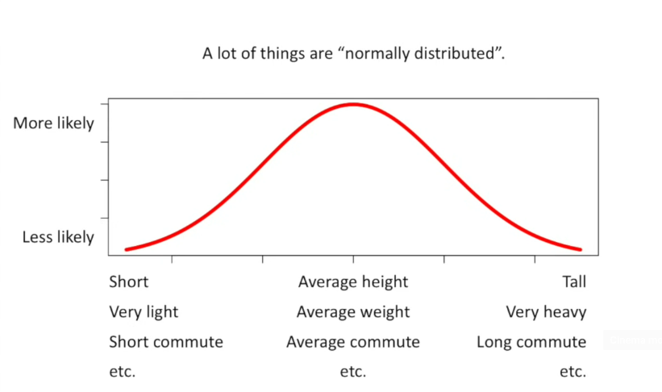
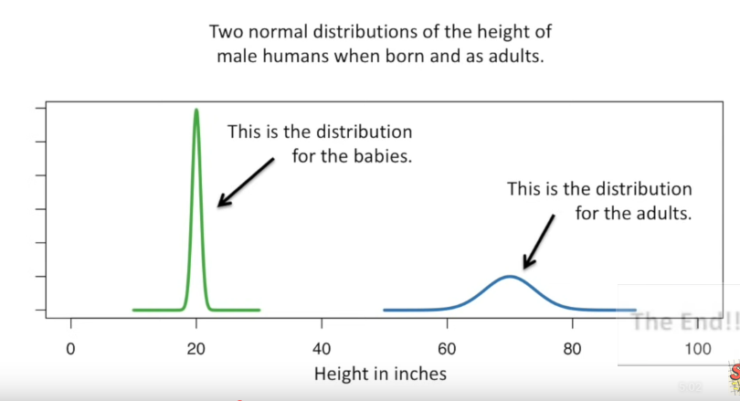
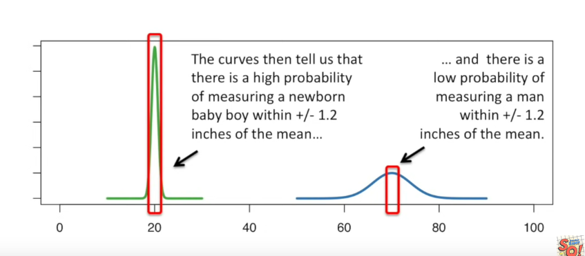

# The Normal Distribution

reference - https://www.youtube.com/watch?v=rzFX5NWojp0

---

 

***Normal or Gaussian distribution (bell shaped curve)***

The y-axis represents the relative probability of observing someone who is really short, or really tall, or who has an average height.

 

Just looking at the graph, we can tell that there is a high probability that a newborn baby will be between 19 and 21 inches tall.
In contrast, adults are between 60 and 80 inches tall.
The curve for babies is way tall compared to the curve for adults. This is because there are more possibilities for adult height than for babies. The more options there are for height, the less likely any specific measurement will be one of them. 
***The Width of the curve is defined by the standard deviation.***
By looking at the curves that babies have a relatively small standard deviation compared to adults.
The standard deviation for babies is 0.6. The standard deviation for adults is 4.
Knowing the standard deviation is helpful because normal curve are drawn such that 95% of the measurements fall between +/- 2 standard deviations around the mean.
This  means that 95% of the baby measurements fall between 20 +/- 1.2 inches. And 95% of the adult measurements fall between 70 +/- 8 inches.

 

### To draw a normal distribution, you need to know:

1. The average measurement. This tells us where the center of the curve goes.
2. The standard deviation of the measurements, this tells us how wide the curve should be. And the width of the curve determines how tall it is. The wider the curve, the shorter. The narrow the curve, the taller.

 

---